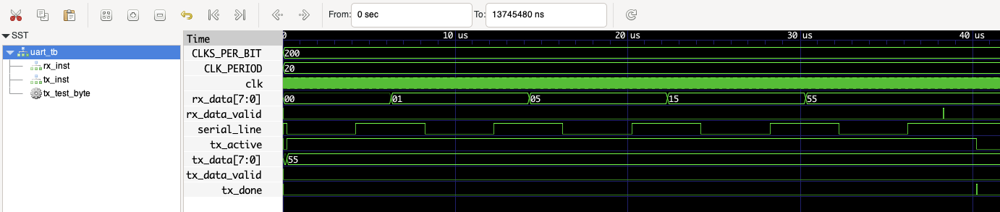

# UART Communication System in Verilog

This project provides a Verilog-based UART (Universal Asynchronous Receiver Transmitter) communication system, capable of serial data transmission and reception. It includes transmitter and receiver FSM modules, integrated into a top-level module for bidirectional communication. This implementation is designed for the Terasic P0150 FPGA board, based on an Intel Cyclone V GX FPGA.

## Features

- **UART Transmitter (`uart_tx`)**: Transmits 8-bit data, handling idle, start, data, and stop states.
- **UART Receiver (`uart_rx`)**: Receives 8-bit data, detecting start, data, and stop bits.
- **Loopback Example**: Demonstrates basic functionality by receiving data, incrementing it, and sending it back out via UART.

## Quick Steps to Run Simulation

1. **Compile the design**:

    ```bash
    make
    ```

2. **Run the simulation**:

    ```bash
    make run
    ```

3. **View waveforms in GTKWave**:

    ```bash
    make wave
    ```

4. **Clean up generated files**:

    ```bash
    make clean
    ```

## Simulation Results

Below is an example of the simulation output visualized in GTKWave, showing the UART transmission and reception of data.



